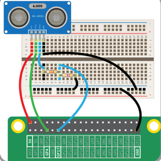
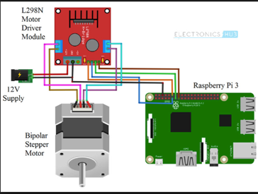
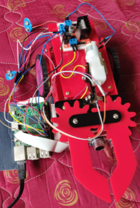
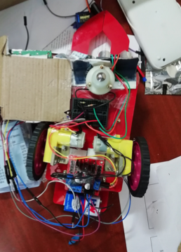

# robot-garbage-collector
## Introduction: 
In this project, we will create a robotic car, that would detect garbage and pick it up while leaving non-garbage items aside. This is a pick and place robot which can be used to pick up trashcans on less traffic areas like corridors of an apartment. This robot uses a raspberry pi to control the motors, ultra-sonic sensor and a camera. The raspberry pi is then loaded with a custom trained CNN model, so that it can discriminate between what is a garbage and what is not a garbage.

## Components Required:

•	Pick and place car chassis
•	2 motor drivers
•	2 batteries
•	raspberry pi
•	Ethernet cable
•	Micro USB cable
•	ultrasonic sensor
•	pi cam
•	jumper wires
•	mini bread boards
•	330e and 470e resistors

## Working:

1.	Initially, when the car is turned on, the car moves in a straight line, until it comes across an obstacle.
2.	As soon as it detects an obstacle, it stops itself at a distance of 20 cms.
3.	Then it captures a photo of the object infront of it.
4.	To get the right image and to detect the object precisely, both ultrasonic sensor and pi cam are placed side by side, below the gripper.
5.	Then the captured image is classified as a coke bottle or a tupper ware bottle using a custom trained small CNN model that is saved to raspberry pi.
6.	If the image is classified as a coke bottle, it executes the following steps.
o	Opens the gripper.
o	Moves forward until the obstacle is 5cm ahead.
o	Then it closes the gripper and keeps using the force to avoid losing contact.
o	Then another motor is used to lift the bottle up.
o	The car moves left with the bottle held up and then releases the bottle
o	The car moves back and continues in the same path.
o	Go back to step 1 and continue until stopped manually.
7.	Else it moves right and then left to continue in the same straight path.

## Pin diagrams:

## Working screenshots:
Top view and bottom view of the robot

